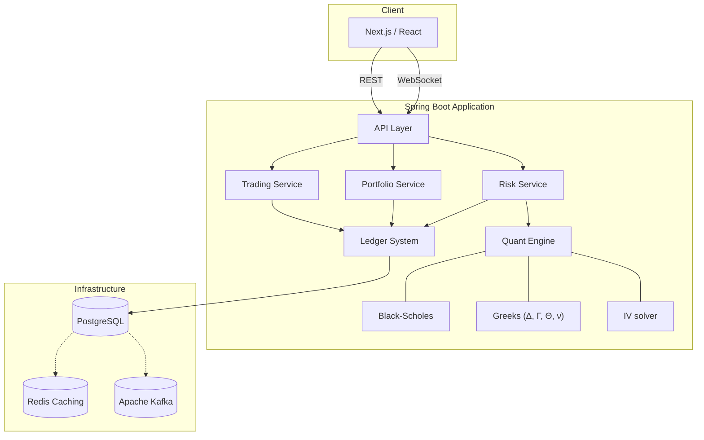
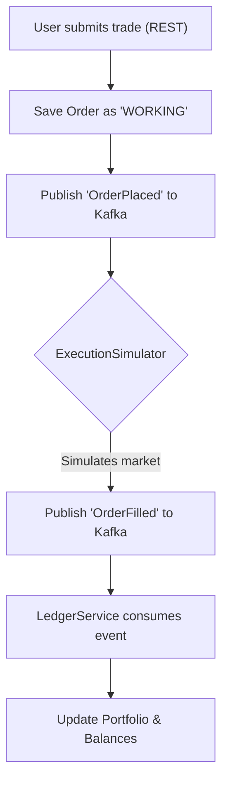
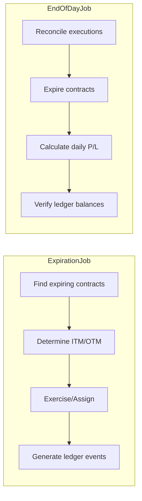

# Developer Guide

## 1. High-Level Architecture

The frontend communicates with the backend via REST (for actions) and WebSockets (for live data). The backend delegates intensive math to the Quant Engine and relies on Kafka for asynchronous processing.


       Next.js / React
              │
      ┌───────┴───────┐
    REST          WebSocket
      │               │
      └───────┬───────┘
              ▼
         Spring Boot
              │
    ┌─────────┼─────────┐
    ▼         ▼         ▼
 Trading  Portfolio    Risk
 Service   Service    Service
    │         │         │  |
    └─────────┼─────────┘  |
              │            |
              ▼            ▼
            Ledger    Quant Engine
              │            │
              │            ├── Black-Scholes
              │            ├── Greeks
              │            └── IV Solver
              ▼
          PostgreSQL
              │
         ┌────┴────┐
         ▼         ▼
       Redis     Kafka


## 2. Codebase Structure

Domain-Driven Design (DDD) by splitting the app into strict Maven modules. 

> [!IMPORTANT]
> Dependencies must only point *inward* toward the domain. The Domain module cannot depend on Spring, JPA, or any external framework.


deriva
 ├── deriva-domain          <-- The Core (Zero Dependencies. Contains User, Order, Instrument)
 ├── deriva-quant           <-- Financial Math Engine (BlackScholes, ImpliedVolatility)
 ├── deriva-application     <-- Use Cases & Orchestration (OrderManagementService, EOD Jobs)
 ├── deriva-market-data     <-- Data Feed Integrations (Yahoo Finance Fetcher, Simulators)
 ├── deriva-infrastructure  <-- Adapters to the Outside World (JPA Repositories, Kafka, Redis)
 ├── deriva-api             <-- HTTP & WebSocket Layer (REST Controllers, STOMP Endpoints)
 ├── deriva-common          <-- Shared Types & Exceptions
 ├── deriva-bootstrap       <-- The Executable Application (Flyway Migrations, AOP Logging)
 └── deriva-frontend        <-- Next.js UI
```

---

## 3. Core Execution Flows

To understand how Deriva operates, you must understand its asynchronous, event-driven nature.

### A. The Order Execution Flow
When an order is placed, it is executed synchronously in the HTTP request.

```text
User Submits Trade (POST /api/v1/orders)
  ↓
Validate Order (Domain logic)
  ↓
Save Order as "OPEN" in PostgreSQL
  ↓
(Sync) ExecutionSimulator evaluates against Market Data
  ↓
Generate Executions (Fills)
  ↓
(Sync) LedgerPort appends TradeExecutionEvent to Postgres
  ↓
Order Status Updated & Saved
```

### B. End-Of-Day & Lifecycle Jobs
Options expire, and portfolios must be reconciled. We use scheduled jobs to manage financial state safely.

```text
LifecycleScheduler (Runs at 4:15 PM)
  ↓
identifyExpiringContracts
  ↓
determineInTheMoney
  ↓
processExercisesAndAssignments
  ↓
settleCashAndStock
  ↓
rebuildProjections

Eventually we also run the end-of-day process:

EndOfDayScheduler (Runs at 5:00 PM)
 ├── reconcileExecutions
 ├── reconcileCashAndPositions
 ├── calculateDailyMetrics
 ├── storeSnapshots
 └── generateReports
```

---

## 4. The Immutable Financial Ledger

> [!WARNING]
> **CRITICAL CONCEPT**: The financial state should **never** be modeled via CRUD updates.

**❌ BAD (Do not do this):**
```text
position.quantity = 300
       ↓
UPDATE position SET quantity = 200  (Loss of historical context!)
```

**✅ GOOD (Event Sourcing):**
We append immutable rows to a ledger. The current balance is simply the sum of all historical events.

```text
Ledger Table:
------------------------------------------------------
| ID | Timestamp | Action | Asset | Qty | Balance    |
|----|-----------|--------|-------|-----|------------|
| 1  | 10:00 AM  | BUY    | AAPL  | +50 | 50         |
| 2  | 11:30 AM  | SELL   | AAPL  | -20 | 30         |
------------------------------------------------------
```

---

## 5. Technology Stack Summary

| Tool | Purpose |
|------|---------|
| **Java 21 & Spring Boot** | Robust, enterprise-grade backend infrastructure and dependency injection. |
| **PostgreSQL & Flyway** | ACID-compliant relational data storage and schema version control. |
| **Apache Kafka** | Decouples services so the system survives partial failures. |
| **Redis** | Ultra-fast caching to serve high-frequency market data without crushing the DB. |
| **WebSockets (STOMP)** | Pushes live price changes to the user instantly. |
| **Next.js & React** | Server-rendered, modern frontend framework. |

---

## 6. Bug Hunting Quick Reference

If something breaks, here is where you look:

> [!NOTE]
> **Pro Tip:** Always monitor `app.log`. We use Spring AOP to automatically log the entry of every single method call in the application!

* **UI/Visual Glitches**: 👉 `deriva-frontend/src/app`
* **API returns HTTP 500**: 👉 `deriva-api/src/.../controller`
* **Orders stuck in 'WORKING'**: 👉 Check Kafka consumers in `deriva-infrastructure/src/.../messaging`
* **Math/Pricing is wrong**: 👉 `deriva-quant/src/.../pricing/BlackScholes.java`
* **HTTP 403 Forbidden**: 👉 Add the route to `SecurityConfig.java` in the API module.
* **Adding a Database Table**: 👉 Add a `.sql` script in `deriva-bootstrap/src/main/resources/db/migration/`.

# Deriva: Developer & Intern Guide 🚀

Welcome to **Deriva**, an institutional-grade options and derivatives trading platform. This document is designed to give you a clear, visual, and highly readable overview of our system architecture and code structure.

---

## 1. High-Level Architecture

Our architecture is strictly event-driven. The frontend communicates with the backend via REST (for actions) and WebSockets (for live data). The backend delegates intensive math to the Quant Engine and relies on Kafka for asynchronous processing.



---

## 2. Codebase Structure (Clean Architecture)

We enforce **Domain-Driven Design (DDD)** by splitting the app into strict Maven modules.

> [!IMPORTANT]
> **The Golden Rule:** Dependencies must only point *inward* toward the domain. The Domain module cannot depend on Spring, JPA, or any external framework.

* 📦 **`deriva-domain`**: The Core. Pure Java. Contains `User`, `Order`, `Instrument`.
* 🧮 **`deriva-quant`**: The Math Engine. Contains pricing models and normal distributions.
* ⚙️ **`deriva-application`**: The Orchestrator. Contains Use Cases (`OrderManagementService`) and Scheduled Jobs.
* 🔌 **`deriva-infrastructure`**: The Adapters. Contains JPA Repositories, Kafka Producers/Consumers, and Redis config.
* 🌐 **`deriva-api`**: The Web Layer. Contains REST Controllers, STOMP Endpoints, and Spring Security.
* 📊 **`deriva-market-data`**: The Data Feeds. Fetches Yahoo Finance data and runs simulators.
* 🚀 **`deriva-bootstrap`**: The Executable. Wires everything together and runs Flyway DB Migrations.

---

## 3. Core Execution Flows

### The Order Execution Flow

Orders are handled asynchronously via Event Sourcing. When an order is placed, it is sent to Kafka rather than executed synchronously.



### End-Of-Day & Lifecycle Jobs

Our system handles automated portfolio reconciliation and options expiration via scheduled chron jobs.



---

## 4. The Immutable Financial Ledger

> [!WARNING]
> **CRITICAL CONCEPT**: The financial state should **never** be modeled via CRUD updates.

**❌ BAD (Do not do this):**

```sql
UPDATE position SET quantity = 200;
```

*Why? This destroys historical context.*

**✅ GOOD (Event Sourcing):**

We append immutable rows to a ledger. The current balance is simply the sum of all historical events.

| ID | Timestamp | Action | Asset | Qty | Balance |
| -- | --------- | ------ | ----- | --- | ------- |
| 1  | 10:00 AM  | BUY    | AAPL  | +50 | 50      |
| 2  | 11:30 AM  | SELL   | AAPL  | -20 | 30      |

---

## 5. Technology Stack Summary

| Tool                      | Purpose                                                                         |
| ------------------------- | ------------------------------------------------------------------------------- |
| **Java 21 & Spring Boot** | Robust, enterprise-grade backend infrastructure and dependency injection.       |
| **PostgreSQL & Flyway**   | ACID-compliant relational data storage and schema version control.              |
| **Apache Kafka**          | Decouples services so the system survives partial failures.                     |
| **Redis**                 | Ultra-fast caching to serve high-frequency market data without crushing the DB. |
| **WebSockets (STOMP)**    | Pushes live price changes to the user instantly.                                |
| **Next.js & React**       | Server-rendered, modern frontend framework.                                     |

---

## 6. Bug Hunting Quick Reference

If something breaks, here is where you look:

> [!NOTE]
> **Pro Tip:** Always monitor `app.log`. We use Spring AOP to automatically log the entry of every single method call in the application!

* **UI/Visual Glitches**: 👉 `deriva-frontend/src/app`
* **API returns HTTP 500**: 👉 `deriva-api/src/.../controller`
* **Orders stuck in 'WORKING'**: 👉 Check Kafka consumers in `deriva-infrastructure/src/.../messaging`
* **Math/Pricing is wrong**: 👉 `deriva-quant/src/.../pricing/BlackScholes.java`
* **HTTP 403 Forbidden**: 👉 Add the route to `SecurityConfig.java` in the API module.
* **Adding a Database Table**: 👉 Add a `.sql` script in `deriva-bootstrap/src/main/resources/db/migration/`.


