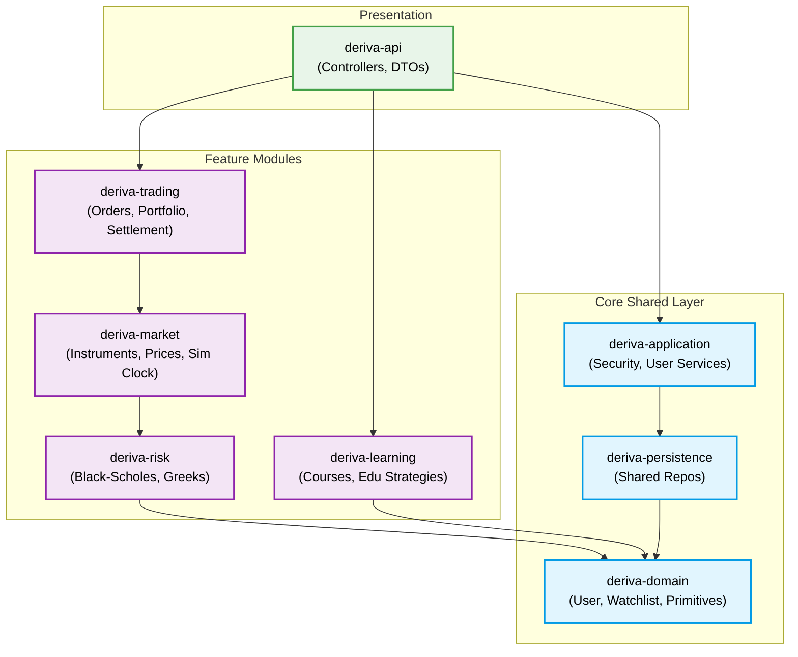

# Deriva - Options Trading Simulator

Deriva is an options trading simulation platform designed with a **Modular Monolith** architecture. By separating the codebase into distinct functional modules, the application enforces clean boundaries between core primitives, mathematical engines, market simulation, and business logic.

## Architecture & Module Responsibilities

The project is structured into several Maven modules. The core philosophy is that foundational primitives reside at the bottom (`domain`), specialized bounded contexts (like `risk`, `market`, `trading`) build on top of each other in a strictly acyclic dependency graph, and the `api` module exposes the system.

### 1. Core & Shared Modules
*   **`deriva-domain`**
    *   **Responsibility:** The foundation of the application. Holds universally shared primitives, enums, and base entities that don't belong to a single specialized context.
    *   **Key Classes:** `User`, `Role`, `Watchlist`, `OptionType`, `OrderSide`.
*   **`deriva-persistence`**
    *   **Responsibility:** Core shared database interactions and Spring Data JPA repositories.
    *   **Key Classes:** `UserRepository`, `WatchlistRepository`.
*   **`deriva-application`**
    *   **Responsibility:** Shared application services and global security configuration.
    *   **Key Classes:** `UserService`, `SecurityConfig`, `CustomUserDetails`.
*   **`deriva-api`**
    *   **Responsibility:** The presentation layer. Contains REST controllers, DTOs, Exception handlers, and the Spring Boot Main application runner.

### 2. Feature Modules (Bounded Contexts)
*   **`deriva-risk`**
    *   **Responsibility:** Pure mathematical engine for pricing and risk metrics. It contains no stateful trading logic, isolating the complex math so it can be cleanly tested and reused.
    *   **Key Classes:** `BlackScholesModel`, `OptionGreeks`, `ImpliedVolatilityCalculator`, `SavedAnalysis`.
*   **`deriva-market`**
    *   **Responsibility:** Market simulation and asset definitions. Generates price ticks, handles option contracts, and simulates market time.
    *   **Key Classes:** `Instrument`, `OptionContract`, `MarketPriceSnapshot`, `SimulationClockService`.
*   **`deriva-trading`**
    *   **Responsibility:** User order execution, portfolio management, and trade settlement logic.
    *   **Key Classes:** `Order`, `Trade`, `PortfolioSnapshot`, `TradingService`, `SettlementService`, `RiskAnalysisService` (Applies risk math to portfolios).
*   **`deriva-learning`**
    *   **Responsibility:** Educational content, courses, and reference templates for trading strategies. Fully isolated from active trading logic.
    *   **Key Classes:** `Course`, `Lesson`, `Strategy` (Template), `StrategyService`.

---

## Architecture Flowchart

